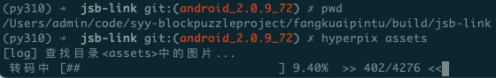
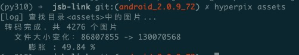
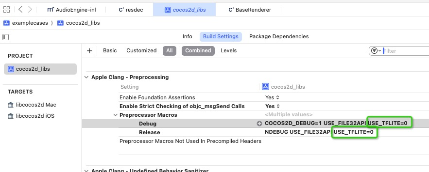
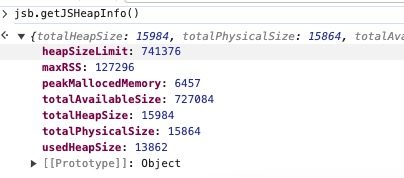

# 引擎扩展接口说明

## GPU 纹理压缩（HyperPix）

>  目前只支持 Android

为了应对不同设备对 GPU 纹理支持的差异，HyperPix 方案将 JPG/PNG 图片转换为一种中间格式。在运行时，根据设备对不同 GPU 纹理格式（如 ASTC、ETC2）的支持情况，将中间纹理转换为目标格式并进行缓存。这样可以节约内存并提升纹理加载速度。在高端设备上，可以考虑关闭此功能，以充分利用其硬件能力。

### 基础使用流程

在 Cocos Creator 导出工程后，只需执行位于引擎 tools/hyperpix 目录下的 hyperpix 命令，传入需要转换的图片资源路径即可。

比如，对所有的图片资源执行转换：



> 命令搜索目录内所有 jpg/png 文件，并进行转换。

结束后输出统计结果



### 接口

**以下接口只对 hyperpix 转换过的资源生效**

```ts
namespace jsb {
  // 开启/关闭 转码功能。
  // 在 关闭的情况下纹理格式为不压缩的 RGBA8888。 默认开启。
  function enableGPUTextureTranscoding();
  function disableGPUTextureTranscoding();

  // 开启/关闭 GPU 纹理缓存(只有在开启转码功能时生效)
  // 开启时 GPU 纹理会被存储到磁盘上，避免重复解码。 默认开启。
  function enableGPUTextureCache();
  function disableGPUTextureCache();
  
  // 清除 GPU 纹理缓存
  // 大版本更新，或者缓存资源认定失效时可以主动清除 
  function clearGPUTextureCache();
}
```

### 注意事项

1. HyperPix 的转换需要在加密之前执行。
2. 请勿对工程内的资源进行转换，只能处理 Cocos Creator 构建导出的资源。
3. 中间格式可能会导致图片文件变大，因此需选择性地转换图片资源。
4. 如果在运行时调用 `jsb.disableGPUTextureTranscoding()`, 只会影响后续的行为。 第一个场景加载还是会安装默认行为执行。 所以建议尽快（在第一个场景中的脚本中）配置，确保主场景中生效。

## Web Worker 支持

```ts
interface WorkerEvent {
    data:any;
}

class Worker {
  constructor(path:string); // path 为 js 脚本的路径
  postMessage(data:any); // 发送消息到 worker 线程
  onmessage: (event:WorkerEvent)=>void; // 处理 worker 线程发过来的消息
  terminate(); // 结束 worker
}

/// worker 线程接口


onmessage: (event:WorkerEvent)=>void; // 处理 【创建 worker 的线程】发过来的消息
postMessage(msg:any);  // 发送消息到【创建 worker 的线程】
close(); // 关闭当前 worker 线程
```

参考[标准文档](https://developer.mozilla.org/en-US/docs/Web/API/Web_Workers_API/Using_web_workers#web_workers_api)

**注意事项**：

- 当前 Worker 是 Web Worker 的子集，实现不完全一致。详细信息对照上文。
- SharedWorker 等扩展不支持
- 由于 Cocos Creator 资源管理器对 `.js` 后缀文件存在定制处理流程，需要把脚本文件后缀修改为 `.wjs`.
- Worker 不支持直接访问文件系统。如果需要读取配置，可以通过 postMessage 从逻辑线程发送过去。

[查看示例](./docs/worker/demo.md)

## Tensorflow-Lite JSB 接口

新增接口

```ts
  namespace jsb {
    loadModel(buffer:ArrayBuffer):number; // 返回 ID

    // 同步执行，模型的输出直接写入 output
    executeModel(modelId:number, input:Float32Array, output:Float32Array):boolean;

    // 独立线程异步执行，模型的输出直接写入 output
    executeModel(modelId:number, input:Float32Array, output:Float32Array, callback:(ret:boolean)=>void):void;

    unloadModel(modelId:number):void;
  }
```

注意：原生层不会复制模型的数据，需要在 JS 层保持引用，避免被 GC。

#### 在 CocosApplication.mk 中添加开关

```mk
USE_TFLITE := 1
```

#### Xcode 中修改 Build Settings



修改

```
USE_TFLITE=1
```

### 示例

```ts
const input = new Float32Array(8 * 8 * 3);
const output = new Float32Array(43);
const modelRawData = [];

// 加载模型 
const buffer = (jsb.fileUtils as any).getDataFromFile(modelFile.url).buffer
const modelId = jsb.loadModel(buffer);
modelRawData.push(buffer);

// 准备 input
for (let i = 0; i < 8; i++) {
    for (let j = 0; j < 8; j++) {
        let s = (i * 8 + j) * 3;
        input[s] = board.state.emptyAt(i * 8 + j) ? 0 : 1;
        input[s + 1] = 0;
        input[s + 2] = 0;
    }
}

// 执行模型
jsb.executeModel(modelId, input, output);

// 收集模型输出
let ret = getMax(output);


// 卸载模型

jsb.unloadModel(modelId);

```

## JS 内存查询（Android + iOS）

接口 `jsb.getJSHeapInfo()` 用于查询当前 JS 引擎的堆内存使用概况。

返回下面的数据（单位为kB）

```ts
{
  maxRSS:number;              // 进程最大常驻内存集
  heapSizeLimit:number;       // JS 堆大小限制
  totalAvaiableSize:number;   // JS 可用的堆余量
  totalHeapSize:number;       // JS 总的堆大小
  totalPhysicalSize:number;   // JS 堆的物理大小，
  peakMallocedMemory:number;  // JS 动态分配峰值
  usedHeapSize:number;        // JS 已使用的堆大小。
}
```

大部分情况下，我们只需要关注 `usedHeapSize`.

**示例：**



需要兼容 web 环境

```ts
if(cc.sys.isNative) {
  const info = jsb.getJSHeapInfo();
  // do upload , etc.
}
```

## 查询启动时间

获取冷启动至今的时间（毫秒）

```ts
namespace jsb {
   const msSinceStart;
}
```

可用于获取冷启动所需的时间。

**示例**

```typescript
// 全局作用域
let everReportBootTime = false;
//...

// 首场景中
start() {
  if(cc.sys.isNative && typeof jsb.msSinceStart !== 'undefined' && !everReportBootTime) {
    reportBootTime(jsb.msSinceStart); // 上报冷启动时间
    everReportBootTime = true;
  } 
}

```

## 帧率监控(Android)

本模块用于性能监控和诊断，能够在运行时监控应用的性能指标，尤其是关注帧率（FPS）。主要功能包括：

**帧率监控和低帧率警报**

通过 `jsb.framerate` 对象，可以设置帧率阈值和监测参数，当应用的帧率低于设定的阈值时，会触发一个回调函数。应用可以在帧率降低时立即得到通知，并能通过LowFpsInfo接口获取到当前帧率、目标帧率以及近期帧渲染时间的数据。这些数据可以帮助分析性能瓶颈并采取优化措施。

**详细的进程信息获取**

`jsb.getProcessInfo` 函数提供了在指定时间内收集关于当前进程的详细信息，包括CPU和内存使用情况、线程数以及其他关键性能指标。这些信息对于诊断性能问题、监控资源使用情况以及优化应用有益。

### 接口说明

```typescript
declare namespace jsb {

    // 接口：低帧率信息
    interface LowFpsInfo {
        fps: number;             // 当前的帧率
        targetFps: number;       // 目标帧率，通常是游戏或应用期望达到的帧率
        frames: Int16Array;      // (单位：毫秒)记录在测量窗口内每一帧的耗时的Int16Array，用于进一步分析帧率问题
    }

    // 对象：用于设置和处理低帧率情况
    const framerate: {
        threshold: number;                    // 帧率阈值，单位：FPS，如果实际帧率低于此值，将触发回调函数
        measurementWindow: number;            // 测量窗口大小，帧数目，在这个时间窗口内，系统会监控和计算平均帧率
        interval: number;                     // 回调函数触发间隔，单位：毫秒，两次回调函数的执行间隔不低于这个时间。避免回调频繁调用。
        setCallback(cb: (info: LowFpsInfo) => void); // 设置一个回调函数，当帧率低于阈值时调用，接收一个LowFpsInfo对象作为参数
    } | undefined;

    // 接口：进程信息
    interface ProcessInfo {
        pid: number;             // 进程ID
        totalMem: number;        // 系统总内存，单位：kB
        availableMem: number;    // 系统可用内存，单位：kB
        cpuNum: number;          // CPU核心数量
        sysCpuUsage: number;     // 系统CPU使用率，表示整个系统的CPU使用情况，不仅仅是当前进程
        procCpuUsage: number;    // 当前进程的CPU使用率
        threadNumInProc: number; // 当前进程中的线程数量
        rss: number;             // 进程的常驻内存集大小（Resident Set Size），单位：kB，表示分配给该进程的内存中当前实际驻留在RAM中的部分
        frames: Int16Array;      // 与LowFpsInfo中的frames类似，记录了在一定时间内每一帧的耗时的Int16Array
    }

    // 函数：获取进程信息
    const getProcessInfo: undefined | {
        (periodMS: number, cb: (info: ProcessInfo) => void): void // 获取信息的时长，单位：毫秒。 在这个时间段内统计进程执行信息。
        // 回调函数，每次收集到进程信息时调用，接收一个ProcessInfo对象作为参数
    }
}
```

**注意**：
`sysCpuUsage` 字段在部分设备上由于权限问题无法获取正确的值，会被设置为 0。

### 使用示例

```typescript
if (cc.sys.isNative && jsb.framerate) {
    const fr = jsb.framerate;
    fr.threshold = 20;   // fps < 20
    fr.measurementWindow = 3;
    fr.interval = 1000;  // reportFPS 的调用间隔
    fr.setCallback(reportFPS)
}

function reportFPS(info: jsb.LowFpsInfo) {
    // 可以收集当前的场景信息和用户的操作信息，上报到服务器。
    console.error(`FPS : ${info.fps} is below target ${info.targetFps}, frame: ${info.frames}`);

    // 进一步查询进程信息
    // **不建议频繁调用这个接口，需要自行限制执行频率**
    jsb.getProcessInfo?.(500, (info) => {
      let lines = ["- SysInfo-"];
      lines.push(`PID:        ${info.pid}`);
      lines.push(`TotalMem:   ${info.totalMem}`);
      lines.push(`AvailMem:   ${info.availableMem}`);
      lines.push(`cpuNum:     ${info.cpuNum}`);
      lines.push(`MemUsage:   ${info.rss}`);
      lines.push(`SysCpuUsg:  ${(info.sysCpuUsage * 100).toFixed(2)}`);
      lines.push(`ProcCpuUsg: ${(info.procCpuUsage * 100).toFixed(2)}`);
      lines.push(`ThreadNum:  ${info.threadNumInProc}`);
      // display lines
      // upload(info)
    })
}

// 关闭帧率监听的回调
if(cc.sys.isNative && jsb.framerate) {
  jsb.framerate.setCallback(null); 
}
```

## ASAN 支持(Androdid)

检测潜在的内存错误。

- 支持 api level 27 ～ 34
- arm64

设置 build variant 为 dbgasan


## 脚本执行超时检测

此功能用于监控每一帧的脚本执行时间。当执行时间超过预设阈值时，将触发指定的回调函数。

> 由于使用了特定的信号量，可能出现冲突的情况，需要另外处理。

**支持平台： Android**

```typescript
namespace jsb {
  // 最大执行时间（单位毫秒）
  executionTimeout:number;
  // 超时回调函数
  executionTimeoutCallback?: (stackString:string):void;
}
```

`jsb.executionTimeout` 值小于或等于0时，不触发回调函数。

```typescript
// 在全局作用域中
if(cc.sys.isNative) {
  jsb.executionTimeout = 300；
  jsb.executionTimeoutCallback = (stack) => {
    // 收集 stackTrack 方便后续分析。
  }
}
```

### 使用建议

- 构建时建议勾选 Debug 选项，否则 JS 调用栈可读性差。
- 如果 timeout 值过小，可能导致 回调函数调用过于频繁。
- 功能默认在 Release 模式关闭。**在线上游戏中启用此功能可能会增加额外的性能开销，因此不建议使用。**

若需在 Release 模式下强制启用，可在 CocosApplication.mk 文件中添加以下内容：

```Makefile
APP_CPPFLAGS += -DFORCE_ENABLE_EXECUTION_TIMEOUT_TRIGGER=1
```

## 空闲帧率自适应（Idle Frame Rate Adjustment）

当用户在一定时间内无操作（不触摸屏幕）时，自动降低渲染帧率以减少 CPU 使用率。无论何时，一旦用户进行输入操作，游戏即刻恢复到高帧率状态。

**支持平台： Android**

```typescript
namespace jsb {
  // 开关
  enableIdleFrameRateAdjustment?:boolean;
  // 等待帧数
  maxIdleFrames?: number;
  // 空闲帧率
  idleFrameRate?: number;
}
```

开启/关闭功能

```typescript
// 功能默认*关闭*
// 开启
jsb.enableIdleFrameRateAdjustment = true 
// 关闭
jsb.enableIdleFrameRateAdjustment = false

```

指定无操作触发降帧的**帧数**

```typescript
// 初始之为 600（帧），大约 10 秒

jsb.maxIdleFrames = 900; // 重置为 15 秒
```

指定降帧之后的**帧率**

```typescript

// 初始值为 20 fps
jsb.idleFrameRate = 15; // 重置为 15 fps
```

### 使用建议

建议为不同场景设置特定的空闲帧率，以平衡性能和用户体验。在追求高品质效果的场景中，可以暂时关闭空闲帧率设置，以提高渲染速度和质量。

```typescript
// 进入场景
let origIFAEnabled;
let origIFR;
if(cc.sys.isNative) {
  // 保存原始状态
   origIFAEnabled = jsb.enableIdleFrameRateAdjustment;
   origIFR = jsb.idleFrameRate;
  // 设置场景
  jsb.enableIdleFrameRateAdjustment = true;
  jsb.idleFrameRate = 1;
}
  
// ... ...


// 离开场景
if(cc.sys.isNative) {
  // 恢复设置
  jsb.enableIdleFrameRateAdjustment = origIFAEnabled;
  jsb.idleFrameRate = origIFR;
}
```
