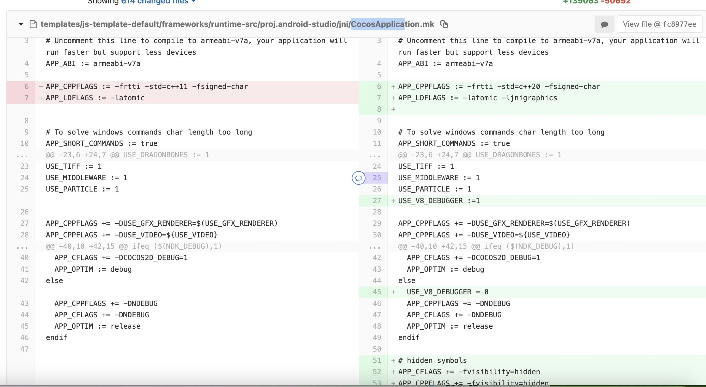
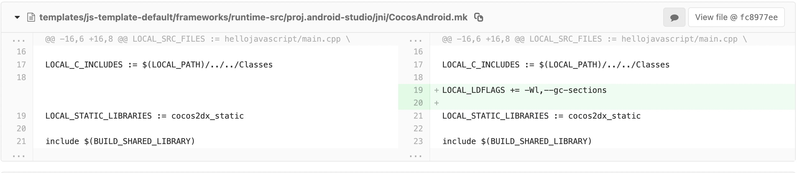
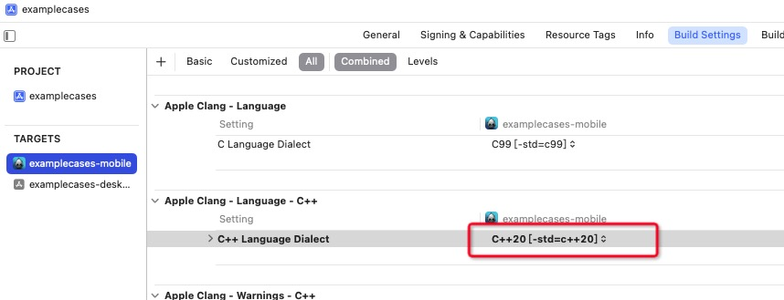

## 升级 V8 

Changes
- 升级 v8 到 12.0.267.10
- C++11 升级到 C++20
- 部分编译参数修改

### 升级步骤
1. 对于现有的工程， 需要修改工程模板中的 CocosAndroid.mk 和 CocosApplication.mk. 
  请参考源码中的文件和下面的差异 (以源码中的文件为准)：

2. Android NDK 请使用 25.2 或更高版本。

3. Xcode 中修改 Build Settings/Apple Clang - Language - C++/C++ Language Dialect 为 C++20。

