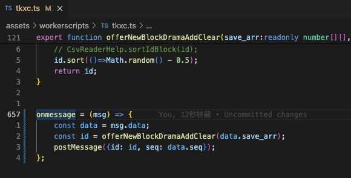
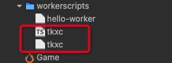
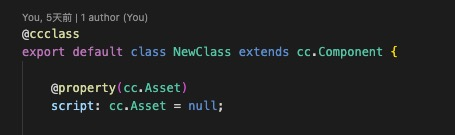
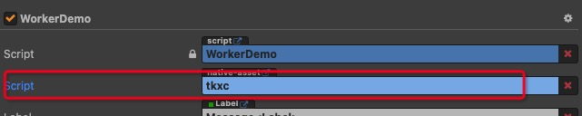
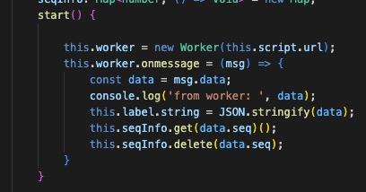
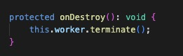
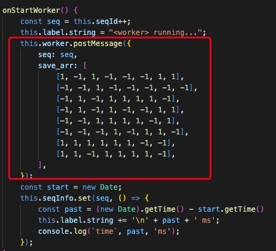

# Web Worker 使用示例

以下是如何在项目中使用 Web Worker 的步骤，通过示例演示如何在 Worker 中运行填空消除算法。

### 1. 实现 worker 逻辑。

首先，需要在独立线程中编写 Worker 逻辑。该逻辑在一个单独的 .wjs 文件中执行，以便与主线程的游戏引擎解耦。



> `onmessage` 根据逻辑线程发送过来的数据执行业务逻辑。

**注意：最好在 `onmessage` 函数内添加 `try/catch` 捕获异常，并且正确处理。**

### 2. 编译到 js

```bash
tsc tkxc.ts
```

**注意：Worker 内不得引入对浏览器/引擎API的依赖**

### 3. 重命名到 wjs

```bash
mv tkxc.js tkxc.wjs
```

在资源管理器可以看到这两个文件



**注意：大多数情况下，Worker 的原始 TypeScript 文件不应放在 assets 目录中，以避免重复引入和编译。**

### 4. 组件脚本中定义 Asset 属性，引用 `.wjs` 资源



配置



> 这里的 tkxc 为 `tkxc.wjs` 资源。

### 5. 使用 worker

创建 Worker



> `this.script` 为前面设置的 `.wjs` 资源。

销毁 Worker



发送事件



### 6. 调试

在原生平台上支持日志输出，但暂时不支持直接调试 Worker。

建议在浏览器中调试开发，后续直接部署到原生平台。
